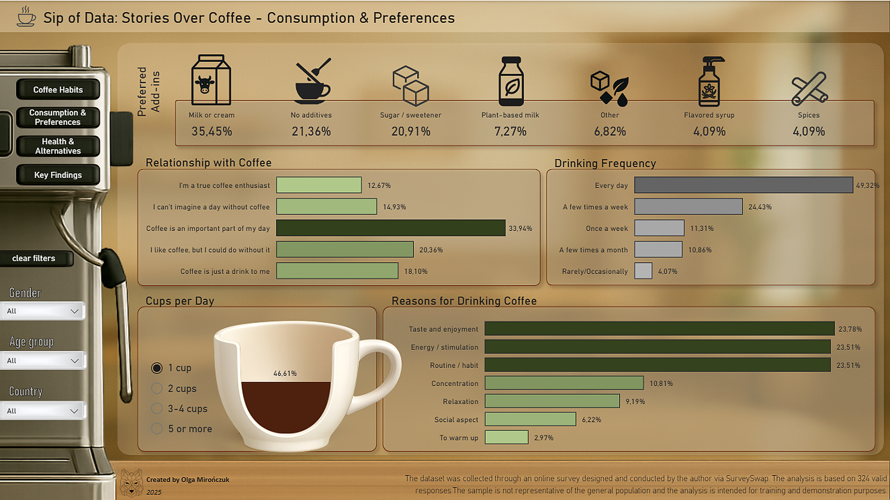
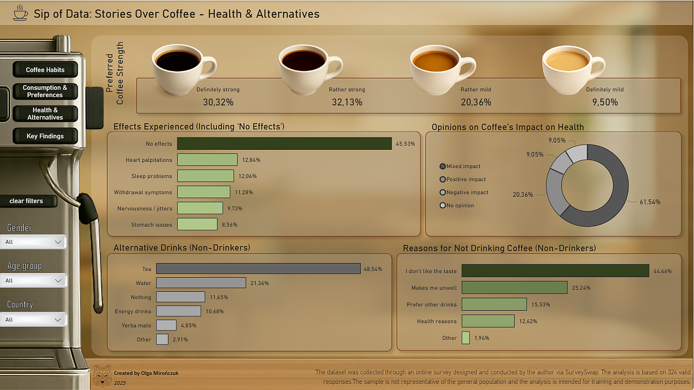

# Sip of Data: Stories Over Coffee 

## 1. Project Overview  
This project visualizes the results of an online survey about **coffee habits and preferences**.  
The dashboard was built in **Power BI** as part of a portfolio project and a practical exercise in:  
- data cleaning and transformation,  
- relational modeling,  
- creating DAX measures,  
- building an interactive report.  

---

## 2. Goal and Data  

**Project goal**  
To describe coffee habits and preferences of survey respondents (n=324): frequency, first coffee timing, preparation methods, add-ins, brew strength, side effects, and alternatives or reasons for not drinking coffee.  

**Data source**  
- Author's online survey (SurveySwap), n=324.  
- Voluntary sample, **non-representative** - results apply only to this sample.  

**Disclaimer**  
The project has a **portfolio/training** purpose. Results are descriptive and not intended for statistical inference or generalization to the population.  

---

## 3. Data Processing  

Full description of the process is in:  
[`processing.md`](./processing.md)  

**Country cleaning**  
Additional files showing the country name standardization process:  
- `clean_and_map_countries.ipynb`  
- `unique_countries.csv` (raw country names)  
- `country_mapping.csv` (draft mapping)  
- `country_mapping_final.csv` (final dictionary + ISO)  

---

## 4. Data Model  

- **Main table:** `coffee_survey_clean` - survey responses after cleaning and label shortening.  
- **Supporting tables (unpivoted):**  
  - `Unpivot_reasons` - reasons for drinking coffee (long format).  
  - `Unpivot_experience` - negative effects of drinking coffee (long format).  
- Relationships: `coffee_survey_clean (1)` -> `Unpivot_reasons (*)`, `coffee_survey_clean (1)` -> `Unpivot_experience (*)`, key = `Index`, bidirectional filtering.  
- DAX measures described in [`dax_measures.md`](./dax_measures.md).  

---

## 5. Dashboard  

The dashboard consists of **four pages**:  

### 5.1 Coffee Habits  
- Coffee preparation methods  
- Coffee drinking location and timing  
- Preferred coffee types  

  

---

### 5.2 Consumption & Preferences  
- Frequency and number of cups per day  
- Relationship with coffee  
- Add-ins and reasons for drinking  



---

### 5.3 Health & Alternatives  
- Coffee strength  
- Experienced side effects  
- Opinions on health impact  
- Reasons for not drinking and alternatives  



---

### 5.4 Key Findings  
- Summary of the main survey insights  


---

## 6. Key Findings  

In this sample, coffee is primarily a daily ritual, especially tied to the morning. The first cup most often appears right after waking up or later in the morning, and coffee is mainly consumed at home or at work.  

Flavor preferences show the dominance of milk-based coffees - latte and cappuccino are the most chosen. However, people who drink "for energy" also choose black coffee and espresso more often than others.  

Motivations are balanced: taste, energy, and routine are mentioned almost equally often. Other reasons include concentration and relaxation, while social aspects or warming up are less frequent.  

Most coffee drinkers do not report negative side effects, although some mention sleep problems, heart palpitations, or nervousness. Opinions about coffee's health impact are mostly "mixed" - cautious, but not strong enough to give up the daily cup.  

Among non-drinkers, tea is the dominant alternative. The main reason for not drinking coffee is dislike of taste, followed by feeling unwell after drinking, preference for other beverages, or health reasons.  

---

## 7. Repository Structure  

```
.
├── data/
│   ├── coffee_survey_clean.csv
│   ├── Unpivot_reasons.csv
│   ├── Unpivot_experience.csv
│   ├── unique_countries.csv
│   ├── country_mapping.csv
│   └── country_mapping_final.csv
├── notebooks/
│   └── clean_and_map_countries.ipynb
├── processing.md
├── dax_measures.md
├── screenshots/
│   ├── coffee_habits.png
│   ├── consumption_preferences.png
│   ├── health_alternatives.png
│   └── key_findings.png
└── README.md
```  

---

## 8. Tools and Skills  

- **Power BI** - data model, Power Query, DAX measures, dashboard design.  
- **Power Query (M)** - transformations, sorting indices, unpivot of multi-choice questions.  
- **Python** - country name cleaning with `pycountry`.  
- **Excel** - merging cleaned country mapping with the main file.  

---

## 9. Disclaimer  

This project was created for **training purposes** and is part of a **portfolio**.  
The dataset is descriptive and results apply only to this sample (n=324).  
